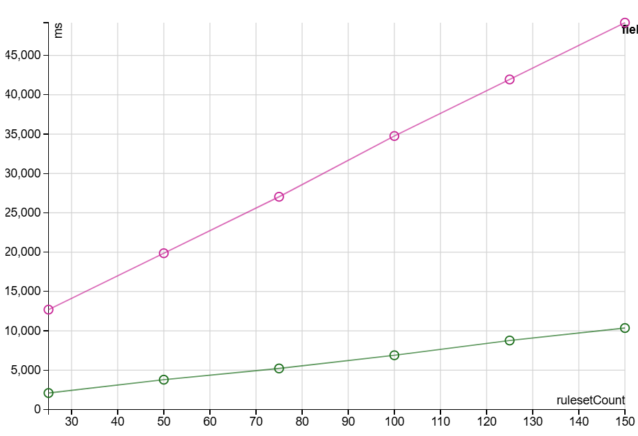
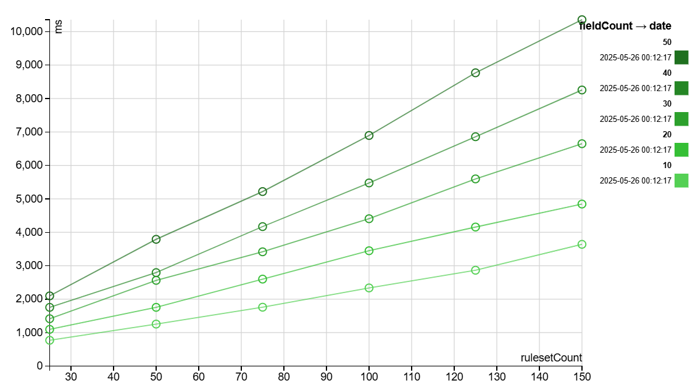

Quality Processors allow for Quality rules to be used on a jvm outside of Spark execution.  Spark is required for expression resolution and compilation so the pattern of usage is:

```scala
import com.sparkutils.quality.sparkless.ProcessFunctions._
case class InputData(fields)

val sparkSession = SparkSession.builder().
  config("spark.master", s"local[1]").
  config("spark.ui.enabled", false).getOrCreate()

registerQualityFunctions() // optional

try {
  val ruleSuite = // get rulesuite
  import sparkSession.implicits._
  // thread safe to share
  val processorFactory = dqFactory[InputData](ruleSuite)
  
  // in other threads an instance is needed
  val threadSpecificProcessor = processorFactory.instance
  try {
    val dqResults: RuleSuiteResult = threadSpecificProcessor(new InputData(...))
  } finally {
    // when your thread is finished doing work close the instance
    threadSpecificProcessor.close()
  }
  
} finally {
  sparkSession.stop()
}

```

### Stateful expressions ruin the fun

Given the comment about "no Spark execution" why is a sparkSession present?  The Spark infrastructure is used to compile code, this requires a running spark task or session to obtain configuration and access to the implicits for encoder derivation.  **IF** the rules do not include stateful expressions (why would they?) and you use the default compilation this is also possible:

```scala
import com.sparkutils.quality.sparkless.ProcessFunctions._
case class InputData(fields)

val sparkSession = SparkSession.builder().
  config("spark.master", s"local[1]").
  config("spark.ui.enabled", false).getOrCreate()
val ruleSuite = // get rulesuite
import sparkSession.implicits._
// thread safe to share
val processorFactory = dqFactory[InputData](ruleSuite)

sparkSession.stop()

// in other threads an instance is needed
val threadSpecificProcessor = processorFactory.instance
try {
  threadSpecificProcessor.initialize(partitionId) // Optional, see below Partitions note
  val dqResults: RuleSuiteResult = threadSpecificProcessor(new InputData(...))
} finally {
  // when your thread is finished doing work close the instance
  threadSpecificProcessor.close()
}
```

The above bold IF is ominous, why the caveat?  Stateful expressions using compilation are fine, the state handling is moved to the compiled code.  If, however, the expressions are "CodegenFallback" and run in interpreted mode then each thread needs its own state.  The same is true for using compile = false as a parameter, as such it's recommended to stick with defaults and avoid stateful expressions such as monotonically_incrementing_id, rand or unique_id.

If the rules are free of such stateful expressions then the .instance function is nothing more than a call to a constructor on pre-compiled code.

In short, given stateful expressions can provide different answers for the same inputs it's something to be avoided unless you really need that behaviour.

### Thread Safety

In all combinations of ProcessorFactory's the factory itself is thread safe and may be shared, the instances themselves are not and use mutable state to achieve performance.

### Partitions / initialize?

Despite all the above commentary on Stateful expressions being awkward to use, if you choose to then you should use the initialize function with a unique integer parameter for each thread.

If you are not using stateful expressions you don't need to call initialize.

## Encoders and Input types

The output types of all the runners are well-defined but, like the input types, rely on Spark Encoder's to abstract from the actual types.

For simple beans it's enough to use the Spark Encoders.bean(Class[_]) to derive an encoder or, when using Scala, Frameless encoding derivation.

!!! note "Java Lists and Maps need special care"
    Using Java lists or maps with Encoders.bean doesn't work very often, the type information isn't available to the Spark code.

    In Spark 3.4 and above you can use AgnosticEncoders instead and specify the types.

What about something more interesting like an Avro message? 

```scala
val testOnAvro = SchemaBuilder.record("testOnAvro")
  .namespace("com.teston")
  .fields()
  .requiredString("product")
  .requiredString("account")
  .requiredInt("subcode")
  .endRecord()
val datumWriter = new GenericDatumWriter[GenericRecord](testOnAvro);

val bos = new ByteArrayOutputStream()
val enc = EncoderFactory.get().binaryEncoder(bos, null)

val avroTestData = testData.map{d =>
  val r = new GenericData.Record(testOnAvro)
  r.put("product", d.product)
  r.put("account", d.account)
  r.put("subcode", d.subcode)
  datumWriter.write(r, enc)
  enc.flush()
  val ba = bos.toByteArray
  bos.reset()
  ba
}

import s.implicits._

val processorFactory = ProcessFunctions.dqFactory[Array[Byte]](rs, inCodegen, extraProjection =
  _.withColumn("vals", org.apache.spark.sql.avro.functions.from_avro(col("value"), testOnAvro.toString)).
    select("vals.*"))
  ...
```

extraProjection allows conversion based on existing Spark conversion functions.

## Map Functions

As correlated subqueries cannot be run outside of Spark the Quality Map functions must be used:

```scala
registerQualityFunctions()

val theMap = Seq((40, true),
  (50, false),
  (60, true)
)
val lookups = mapLookupsFromDFs(Map(
  "subcodes" -> ( () => {
    val df = theMap.toDF("subcode", "isvalid")
    (df, column("subcode"), column("isvalid"))
  } )
), LocalBroadcast(_))

registerMapLookupsAndFunction(lookups)

val rs = RuleSuite(Id(1,1), Seq(
  RuleSet(Id(50, 1), Seq(
    Rule(Id(100, 1), ExpressionRule("if(product like '%otc%', account = '4201', mapLookup('subcodes', subcode))"))
  ))
))
```

Note the use of LocalBroadcast, this implementation of Sparks Broadcast can be used without a SparkSession and just wraps the value.

## Performance

All the information presented below is captured here in [the Processor benchmark](https://sparkutils.github.io/quality/benchmarks/0.1.3.1-RC10-processor-throughput/).  
The run is informative but has some outlier behaviours and should be taken as a guideline only (be warned it takes almost a day to run).  This test evaluates compilation startup time only in the XStartup tests and the time for both startup and running through 100k rows at each fieldCount in a single thread (on a i9-9900K CPU @ 3.60GHz).  The inputs for each row are an array of longs, provided by spark's user land Row, with the output a RuleSuiteResult object.  

??? info "Test combinations to actual rules"
    
    <table><tr><th>rulesetCount</th><th>fieldCount</th><th>actual number of rules</th></tr>
    <tr><td> 25 </td><td> 10 </td><td> 30 </td></tr>
    <tr><td> 25 </td><td> 20 </td><td> 55 </td></tr>
    <tr><td> 25 </td><td> 30 </td><td> 80 </td></tr>
    <tr><td> 25 </td><td> 40 </td><td> 105 </td></tr>
    <tr><td> 25 </td><td> 50 </td><td> 130 </td></tr>
    <tr><td> 50 </td><td> 10 </td><td> 60 </td></tr>
    <tr><td> 50 </td><td> 20 </td><td> 110 </td></tr>
    <tr><td> 50 </td><td> 30 </td><td> 160 </td></tr>
    <tr><td> 50 </td><td> 40 </td><td> 210 </td></tr>
    <tr><td> 50 </td><td> 50 </td><td> 260 </td></tr>
    <tr><td> 75 </td><td> 10 </td><td> 90 </td></tr>
    <tr><td> 75 </td><td> 20 </td><td> 165 </td></tr>
    <tr><td> 75 </td><td> 30 </td><td> 240 </td></tr>
    <tr><td> 75 </td><td> 40 </td><td> 315 </td></tr>
    <tr><td> 75 </td><td> 50 </td><td> 390 </td></tr>
    <tr><td> 100 </td><td> 10 </td><td> 120 </td></tr>
    <tr><td> 100 </td><td> 20 </td><td> 220 </td></tr>
    <tr><td> 100 </td><td> 30 </td><td> 320 </td></tr>
    <tr><td> 100 </td><td> 40 </td><td> 420 </td></tr>
    <tr><td> 100 </td><td> 50 </td><td> 520 </td></tr>
    <tr><td> 125 </td><td> 10 </td><td> 150 </td></tr>
    <tr><td> 125 </td><td> 20 </td><td> 275 </td></tr>
    <tr><td> 125 </td><td> 30 </td><td> 400 </td></tr>
    <tr><td> 125 </td><td> 40 </td><td> 525 </td></tr>
    <tr><td> 125 </td><td> 50 </td><td> 650 </td></tr>
    <tr><td> 150 </td><td> 10 </td><td> 180 </td></tr>
    <tr><td> 150 </td><td> 20 </td><td> 330 </td></tr>
    <tr><td> 150 </td><td> 30 </td><td> 480 </td></tr>
    <tr><td> 150 </td><td> 40 </td><td> 630 </td></tr>
    <tr><td> 150 </td><td> 50 </td><td> 780 </td></tr>
    </table>

As noted above the fastest startup time is with `!#scala compile = false` as no compilation takes place, this holds true until about 
the 780 rule mark where compilation catches up with the traversal and new expression tree copying cost.  Each subsequent instance call
will however pay the same cost again, moreover the actual runtime is by far the worst option:



The lower green line represents the default configuration, which compiles a class and only creates new instances in the general case.  The 
below graph shows the performance trend across multiple rule and field complexities:



In the top right case that's 780 rules total (run across 50 fields) with a cost of about 9.7ms per row (100,000 rows / 10,300 ms) or 0.012ms/rule/row. 

The performance of the default configuration is consistently the best accept for far smaller numbers of rules and field combinations, observable by selecting the 10 fieldCount, every other combination has the default CompiledProjections (GenerateDecoderOpEncoderProjection) in the lead by a good enough margin.  

The majority of cost is the serialisation of the results into the RuleSuiteResult's Scala Maps (via Sparks ArrayBasedMapData.toScalaMap). 

??? info "Experimental - VarCompilation"

    The default of `!#scala forceVarCompilation = false` uses a light compilation wrapping around Sparks MutableProjection approach, with the Spark team doing the heavy lifting.
    
    In contrast the `!#scala forceVarCompilation = true` option triggers the experimental VarCompilation, mimicing WholeStageCodegen (albeit without severe input size restricitons).  
    It's additional speed is driven by JIT friendly optimisations and removing all unnecessary work, only encoding from the input data what is needed by the rules.
    The experimental label is due to the custom code approach, although it can handle thousands of fields actively used in thousands of rules there, and is fully tested it is still custom.
    This may be changed to the default option in the future.
